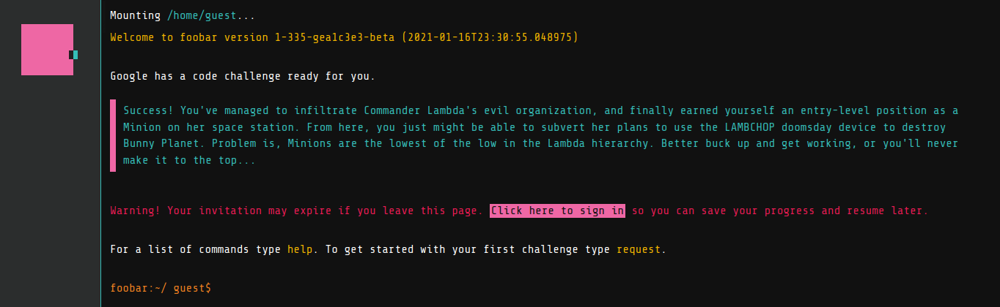
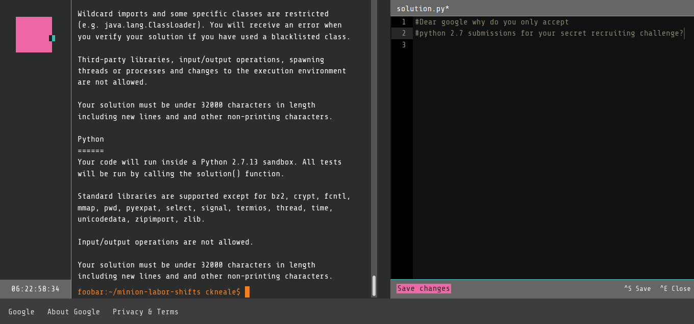
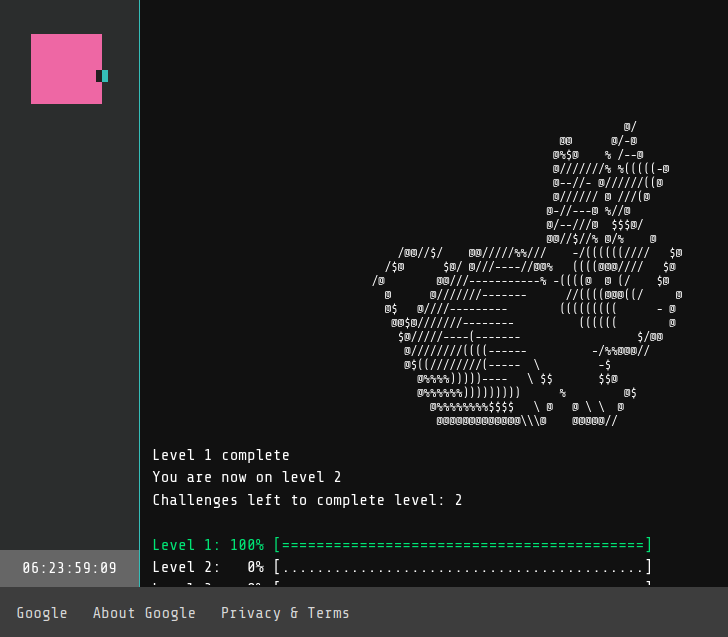
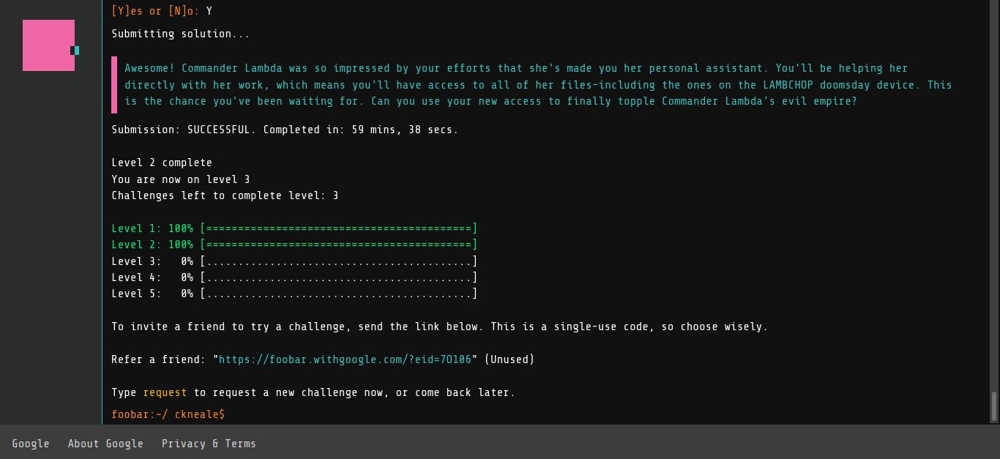
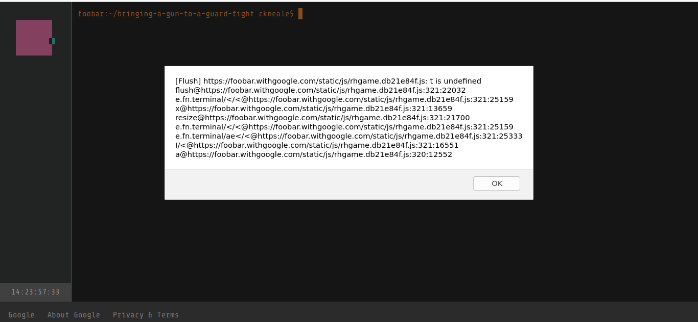
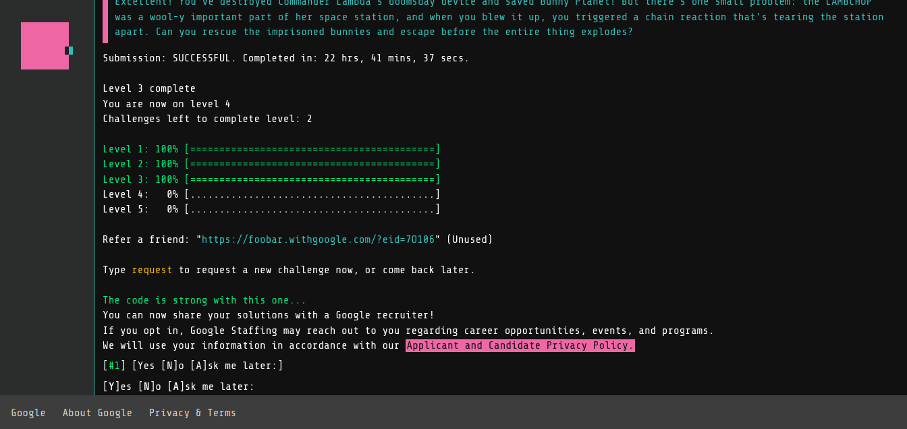
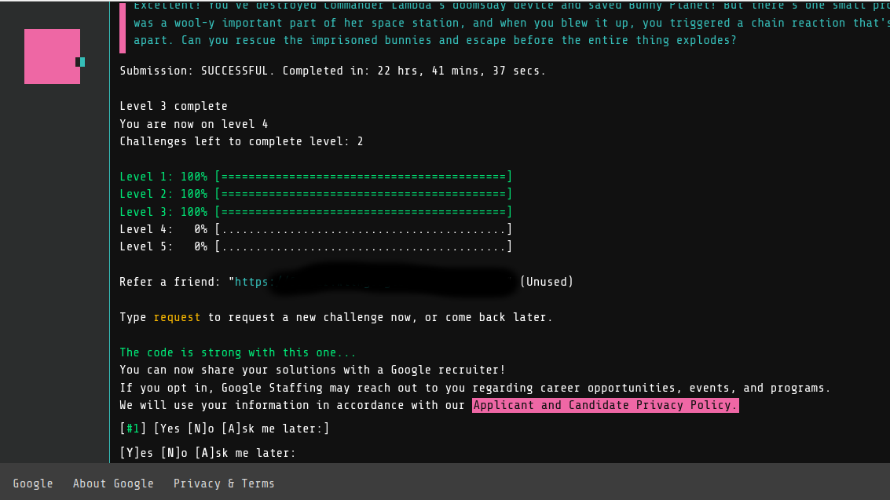
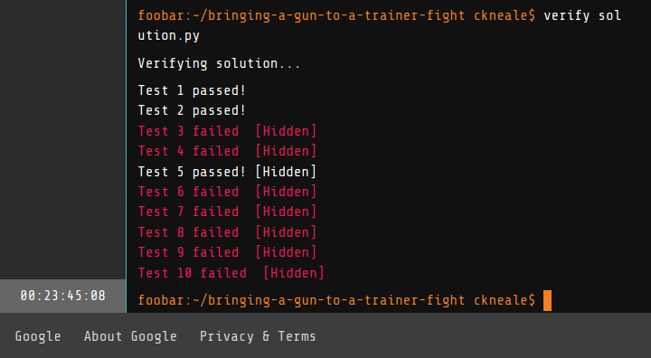

## My Experience with Google's FooBar

In the midst of scouring the internet durring a technical scouting excercise for new programming languages I recieved a really weird offer. I was switching from Haskell to Rust, and really googling some weird stuff. Google Search engine transformed, a question like "would you like to solve questions for Google?" dropped beneath my search bar.

I thought it was a game, so I figured "sure, I can kill 20 minutes". I hit the "yes" button and was transported to another page.

This page acted like a very halfbaked linux terminal, but enough UI/UX to reminding me I was on the internet. 

So I was excited this sounded like fun! Cool game, with some whimsical prompts, retrofeel. They want me to write code - I'm into it. Why not?

Then I read the prompt for code submissions... Told a friend about this weird game's restrictions, does google still use python 2.7? I was then informed that this is a secret recruiting tool. 

Python 2.7 or Java. Okay... Hey look I spent a few years of my life writing Java, and maybe a half a year of my life writing 2.7 before moving to 3.X. I had just finished technical evaluations of some bleeding edge, and intense programming languages. Maybe Python 2.7 would be cathartic?

## The Challenges
So I started zinging through the challenges. Level 1 was was trivial, and I was greeted with ASCII bunnies!

Level 2 was a little harder, but still completely trivial.

Ran into a weird bug at level 2, which I was able to file via the terminal(note the bug was reproduced later for purposes of documenting).

Basically if you try to `clear` the terminal, sometimes it crashes. It does clear the screen though. Who knows? 

Anyways then came Level 3... Level 3 wasn't hard. No the problems were actually pretty easy for the most part. So why did level 3 take me so long? I'll tell you why...

## The Right Tool for the Job
Look, no one picks a programming language that's illsuited for a task unless they absolutely have too. Google asked me to do some mathematics, that just didn't simplify well without a package. Of course, no math packages were allowed for the challenge. So I had to write a math class (a bad one) to pass one of the levels.

I spent the better part of an afternoon on this problem, scratching my head, debugging python 2.7 code. I felt stupid... Stupid for being stuck, and stupid for playing along. To get some confidence in the fact that I knew what I was doing, I wrote the solution to the problem with great performance, in Julia. This took < 30 minutes and only consumed ~20 lines of code. I ended up using that to debug the math API in python.

Let's analyze that a little bit... To solve a FooBar problem, I wrote a fast, concise, highly readable solution to a problem. Then found ways to translate it to a slow, verbose, slightly confusing to read language. 

That was how I beat level 3, but ultimately, lost a piece of my programming spirit. It just wasn't fun anymore even though I was flattered to be able to speak to a recruiter... 

## Python 3.x to Julia to Python 2.7
I made the conscious choice to mostly leave python behind ~2 years ago. There are a variety of reasons why, all of them are practical and related to the line of work I do. Nevertheless, it's always good to revisit previous decisions, and be critical of them. Even if they are successful.

- Did I miss anything from Python? No.
- Did Python offer me anything Julia didn't? No.
- Was Python easier/faster to write? No.
- Was Python faster? No.

It felt like I had just exitted hyperspace by swiftly crash landing on an island that was long inhabitted by a cargocult - the space adventure was no longer fun nor practical... I missed the broadcast operator, basic mathematical data structure support in base, the ability to easily put code in parallel (foobar times out slow code), unicode support, macros, actually thinking about making code fast rather then language specific hacks, and all the other little things you get by just typing `julia` into terminal. 

## Thank You Google
No seriously thank you. I love the search engine, gmail, Go-Lang, and alot of other cool things you do. Thank you for reminding me why I don't use Python (unless I have too), and of the times I saw 2.7 appear in industry and internally shrieked at a soon to be legacy codebase.

If my ego were stronger I'd have just finished the challenge. I mean... I passed most of the unit tests for the last challenge I am on. I know the answer too - but I just can't will myself to do it to myself. 

Maybe I don't want the bragging rights that bad? Maybe my free-time should be directed toward having fun, and strengthening my skills/weaknesses for the real world. Learning Rust lang right now is way more fun and fruitful!
