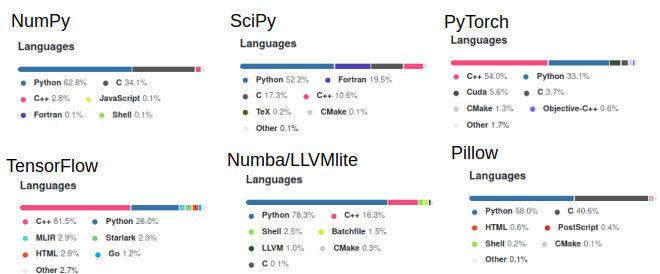

## My Experience with Google's FooBar

I recieved a really weird offer while I was scouring the internet durring a technical scouting excercise for new programming languages. I was switching from Haskell to Rust, and was as you might imagine googling some pretty technical stuff. After a particularly weird query, Google Search engine transformed. A question like "would you like to solve questions for Google?" dropped beneath my search bar.

I thought it was a game, so I figured "sure, I can kill 20 minutes". I hit the "yes" button and was transported to another page. This page acted like a half-baked linux terminal, that had just enough UI/UX to remind me that I was on the internet. 

I was excited this sounded like fun! A cool game, with some whimsical prompts, a fun retro-feel, and I get to write some code. I'm into it - Why not?

Then I read the prompt for code submissions... Python 2.7 or Java. Okay... Told a friend about this weird game's restrictions, "does google still use python 2.7?" I was then informed that this is a secret recruiting tool. Huh... 

Look I've spent a few years of my life writing Java, and maybe a half a year of my life writing in 2.7 before moving to 3.X. I had just finished technical evaluations of some bleeding edge, and intense programming languages. Maybe writing some Python 2.7 would be cathartic? Maybe this would reignite my interests in modern python.

## The Challenges
So I started zinging through the challenges. Level 1 was trivial. After completion, I was greeted with dancing ASCII bunnies!

Level 2 was a little harder, but still pretty darn easy.

I ran into a weird bug at level 2 while trying to clear the terminal. Basically if you try execute `clear`, sometimes the site crashes. It does effectively clear the screen though, but often times it does so with some form of error soup in an alert box. What was kind of cool was that the faux terminal had a command which allowed me to file a bug report.

*(note the bug was reproduced later for purposes of documenting)*

Anyways then came Level 3... Level 3 wasn't hard. The problems were actually pretty easy for the most part, but they took considerably more time to solve. You  might be thinking "Easy? But they took you a while? Riiiight". Time to dedicate a section explicitly to the big issue associated with this challenge...

## The Right Tool for the Job
No one picks a programming language that is ill-suited for a task unless they absolutely have too or they lack the ability/time to learn something new. Google asked me to do some mathematics. The kind that just don't simplify well without a package. Of course, no math packages were allowed for the challenge. So I had to write a math class to pass one of the levels. 

The math class I wrote was pretty bad. Not because I don't know how to write good or even decent code, but python is a pretty bad language for mathematics. The only reason it has survived so long in that space is because it can glue in math code from C, C++, Fortran, etc. If this is news to you, or you're skeptical, check the repositories for commonly used math libraries in modern Python. 

Even Google's TensorFlow knows better than to use pure python, infact less than 20% the library is even python. I'd venture a guess that exactly 0% of it is python 2.7...

Anyways, I spent the better part of an afternoon on one of these problems, scratching my head, debugging python 2.7 code. I felt stupid... Stupid for being stuck, and stupid for playing along. To get some confidence in the fact that I knew what I was doing, I wrote a solution to the problem in Julia. This took < 30 minutes to write, was fast on execution, and only consumed ~20 lines of code(LOC). I ended up using that to debug the ~150 LOC math API in python.

Let's analyze that a little bit... To solve a FooBar recruitment problem, I wrote a fast, concise, highly readable solution to a problem. Then in order to submit it for credit I had to find a way to translate it to a slow, verbose, slightly confusing to read language that has been deprecated. Python 2.7 is [dead](https://www.python.org/doc/sunset-python-2/), and is a language which Google themselves doesn't prefer to use for these kinds of tasks. 

Thats the story of how I beat level 3, but ultimately lost a little piece of my programming spirit. It just wasn't fun anymore. Admittedly I was flattered to be able to speak to a recruiter... It's not like I have a computer science degree, and Google is a powerhouse.

## Python 3.x to Julia to Python 2.7
Roughly 2 years ago I made the conscious decision to leave python outside of my regular toolset. There are a variety of reasons why. All of them are practical and related to the line of work I do. Nevertheless, it's always good to revisit previous decisions, and be critical of them. Even if they are successful decisions. So this was a good time to introspect.

- Did I miss anything from Python? No.
- For this challenge did Python offer me anything Julia didn't? No.
- Did Julia offer me things python didn't? Yes.
- Was Python easier/faster to write than Julia? No.
- Was Python faster than Julia? No.

The context shift of Julia to Python 2.7 was rough. It felt like I had exitted hyperspace by swiftly crash landing on an island that was long inhabitted by a cargocult - the space adventure was no longer fun nor practical... I missed the broadcast operator, mathematical data structures supported in the base language, the ability to easily put code in parallel (foobar times out slow code), track allocations, make short descriptive variables via unicode support, avoid repetitive code by using macros, thinking about making code fast rather then language specific hacks, and all the other little things you get by just typing `julia` into terminal. 

## Thank You Google
I love the search engine, G-mail, Go-Lang, and alot of other cool things you do. Thank you for reminding me why I don't use Python (unless I have to). If my ego were stronger I'd have just finished the challenge. I mean... I passed most of the unit tests for the last challenge I was on. I know the answer too - but I just can't do it to myself. 

My motivation is pretty different here than most peoples, I already have a nice job and am not a masochist. Maybe I also don't want the bragging rights that bad? Or maybe my free-time should be directed toward having fun, and strengthening my skills/weaknesses for the real world. As it currently stands, learning Rust lang. and tinkering away with Julia is just way more fun and fruitful!

## P.S. Google...
If you put [Dex-Lang](https://github.com/google-research/dex-lang), [Numba](https://numba.pydata.org/), and [Python](https://github.com/python/cpython) into a blender you arrive at something like Julia.
